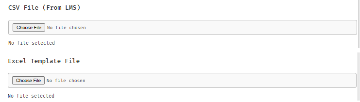
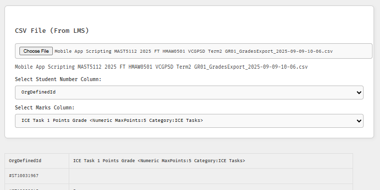
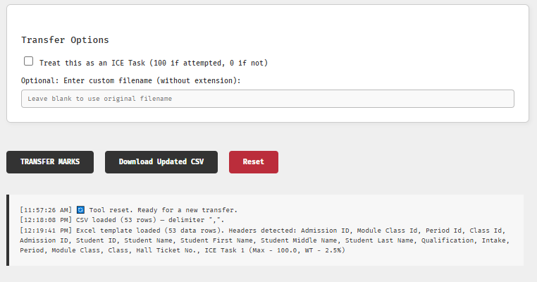

# 📘 Grade Transfer Tool

**A simple, web-based utility to transfer student marks from Brightspace CSV exports into the official Academia Excel template.**

🌐 **Live version**: [Click here to use the tool](https://jesselsookha.github.io/grade-transfer-tool/)

---

## 🚀 Introduction

This tool was developed to support lecturers and administrators in efficiently processing student grades.  
It bridges the gap between **Brightspace D2L** (learning management system) and **Academia** (student information system).

- **Input 1:** Brightspace grade export (`.csv`)  
- **Input 2:** Academia grade template (`.xlsx`)  
- **Output:** Updated Academia template, ready for upload/processing  

The process is entirely browser-based: no installation, no external dependencies, and no student data is uploaded to a server.

---

## 🛠️ How It Works

1. **Upload CSV file** – export a grade item from Brightspace (student numbers + marks).  
2. **Upload Excel file** – official grade sheet template downloaded from Academia.  
3. **Select columns** – map the correct *Student Number* and *Mark* columns in both files.  
4. **Preview** – confirm a sample of 10 records and check total counts.  
5. **Transfer** – the tool matches students and assigns marks automatically.  
   - Blank or missing values become **0**.  
   - In *ICE Mode*, any mark > 0 is treated as **100**, otherwise **0**.  
6. **Download** – save the updated Excel file (or CSV export) with a timestamped filename.  

---

## 📸 Screenshots

*(Screenshots to be added after final UI polish)*

- 
- 
- 

---

## 📂 Repository Structure

| File           | Description                            |
|----------------|----------------------------------------|
| `index.html`   | Main web interface                     |
| `script.js`    | JavaScript logic for parsing & transfer|
| `style.css`    | Styling and layout                     |
| `README.md`    | Main documentation (this file)         |
| `docs/`        | Additional tutorials (CSV & Excel guides) |

---

## 📄 Requirements

- A modern web browser (Chrome, Edge, Firefox recommended).  
- **No installation required** – just open the hosted tool or `index.html` locally.  

---

## 🧭 User Workflow

### 1. Obtain Source Files
- **From Brightspace D2L:** export grades as a CSV file.  
  *(see [Brightspace CSV Guide](docs/brightspace_csv.md))*  
- **From Academia:** download the official grade submission Excel template.  
  *(see [Academia Excel Guide](docs/academia_excel.md))*  

### 2. Use the Tool
1. Open the [Grade Transfer Tool](https://jesselsookha.github.io/grade-transfer-tool/).  
2. Select your **CSV file** and confirm the correct columns.  
3. Select your **Excel file** and confirm the correct columns.  
4. Review the **preview table** (first 10 rows + student count).  
5. Click **Transfer Marks**.  
6. Download the updated file for upload back into Academia.  

---

## 🧠 Notes & Tips

- Student numbers must be identical across both systems.  
- Blank marks are automatically replaced with **0**.  
- ICE Mode applies special grading logic (used for participation-based tasks).  
- Use the **Reset** button anytime to clear files and start over.  
- The tool auto-detects whether CSV uses commas (`,`) or semicolons (`;`) as separators and shows an info message.  

---

## 📢 Credits

Developed by [Jessel Sookha](https://github.com/jesselsookha)  
Published with ❤️ using GitHub Pages.  

---

## 🔗 Hosting Your Own Copy

If you want to deploy this tool elsewhere:

1. Fork this repository.  
2. Enable **GitHub Pages** under your repo settings.  
3. Select `main` branch → root folder.  
4. Access the tool via your GitHub Pages URL.  
